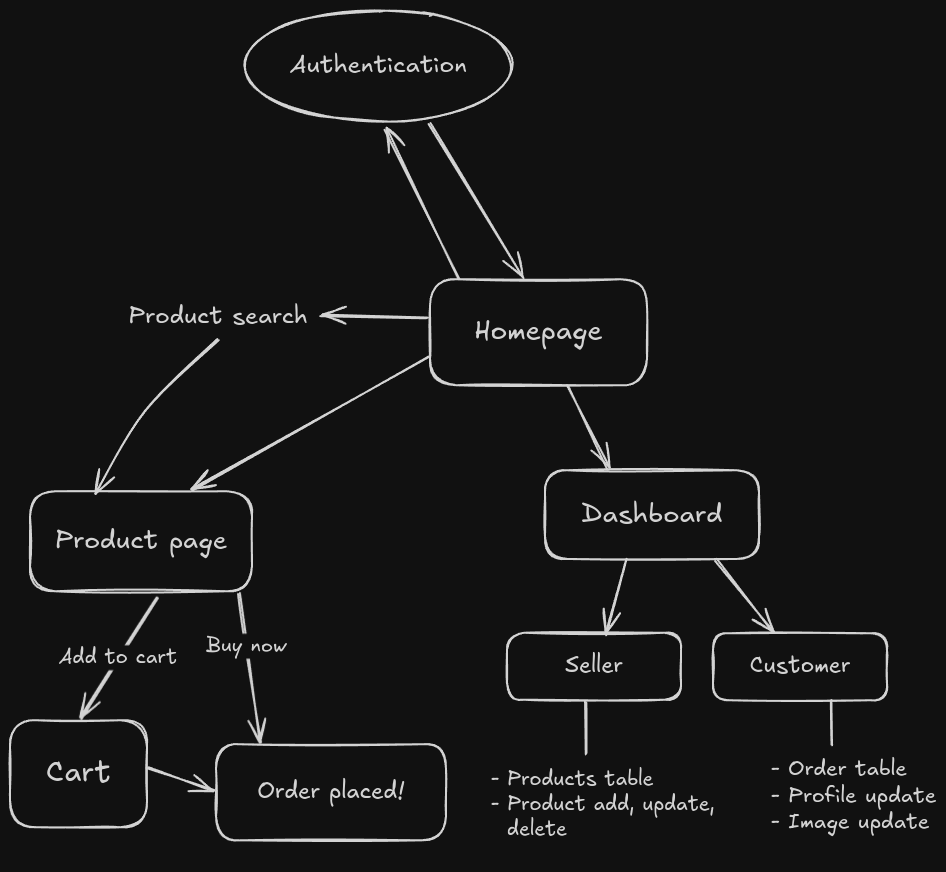

# Amazon Clone

<p align="center">
  
</p>

This is an innovative e-commerce web application clone of Amazon.com built to provide users with a seamless shopping experience while offering sellers a comprehensive platform to showcase and sell their products. With a focus on security, speed, and user experience, it leverages cutting-edge technologies to deliver a robust and feature-rich e-commerce solution.

## Features

- **Secure Authentication**: Utilizes NextAuth for secure authentication, including Google authentication, ensuring user data is protected.
- **Structured Routes**: Implements structured routes using Next.js 14, allowing for efficient navigation and improved SEO.
- **Fast and Smooth User Experience**: Prioritizes performance to deliver a fast and smooth user experience, enhancing user satisfaction and engagement.
- **Seller Dashboard**: Provides sellers with a complete dashboard to manage and upload products, empowering them to showcase their offerings effectively.
- **Customer Dashboard**: Provides customers with a dashboard to view and cancel orders.
- **Cart Functionality**: Enables users to add products to their cart, review cart contents, and proceed to checkout seamlessly, enhancing the shopping experience.
- **Full Text Search**: Implements a powerful search functionality that allows users to search for products using keywords. Utilizes advanced search algorithms to retrieve relevant product details, improving discoverability and user satisfaction.

## Tech Stack

- Next.js 14: A versatile React framework for building server-rendered applications.
- tRPC: A TypeScript RPC library for Next.js, facilitating easy communication between client and server.
- NextAuth: A complete authentication solution for Next.js applications, providing support for various authentication providers.
- Prisma: A modern database toolkit for TypeScript and Node.js, simplifying database operations and migrations.
- Supabase: An open-source Firebase alternative, providing real-time data synchronization and storage capabilities.
- Tailwind CSS: A utility-first CSS framework for building custom designs with ease.
- shadcn/ui: A library of customizable UI components for React applications, offering a modern and responsive UI design.

## App structure

<p align="center">
  
</p>

## Installation

To run app locally, follow these steps:

1. Clone the repository:
   ```
   git clone <repository-url>
   ```
2. Install dependencies:
   ```
   cd amazon-clone
   npm install
   ```
3. Set up environment variables:
   ```
   cp .env.example .env.local
   ```
   Fill in the required environment variables in the `.env.local` file.
4. Run the development server:
   ```
   npm run dev
   ```
5. Open [http://localhost:3000](http://localhost:3000) in your browser to access it locally.
